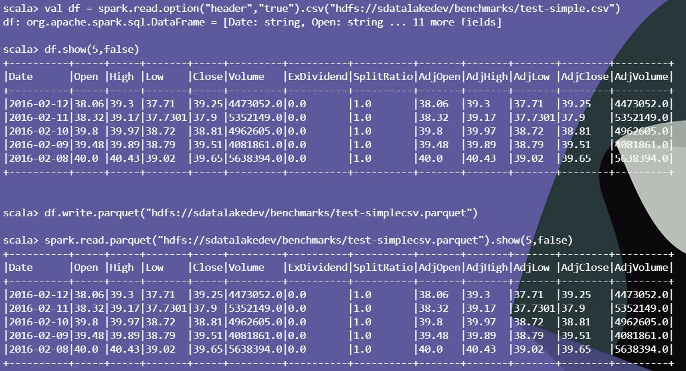

# Setting Environment Variables

export _JAVA_OPTIONS=-Djava.io.tmpdir=$HOME/tmp/spark2-local-tmp (setting it as /tmp is not executable)

export SPARK_MAJOR_VERSION=2

### Launch spark2 shell
spark-shell

### Read CSV

val df = spark.read.option("header","true").csv("hdfs://sdatalakedev/benchmarks/test-simple.csv")

df.show(5,false)

### Write to Parquet

df.write.parquet("hdfs://sdatalakedev/benchmarks/test-simplecsv.parquet")

spark.read.parquet("hdfs://sdatalakedev/benchmarks/test-simplecsv.parquet").show(5,false)

### Screenshot

